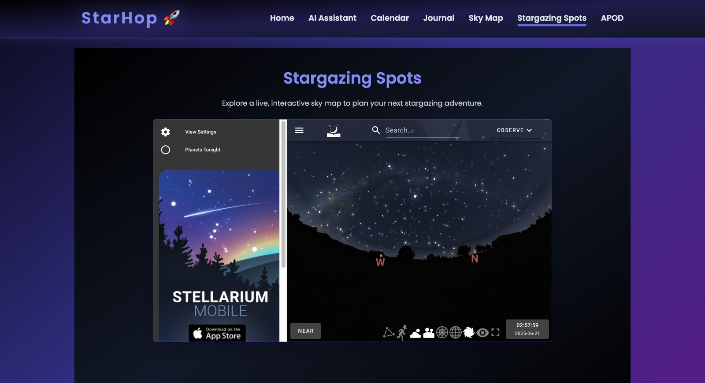

# StarHop

> Your gateway to real-time space tracking, AI-powered space assistant, celestial events, and more.

 

---

## Overview

**StarHop** is a sleek, interactive space web app built with React that lets you:
- Track the International Space Station in real-time 
- View NASA’s Astronomy Picture of the Day 
- Discover stargazing spots near you 
- Explore upcoming celestial events in the cosmic calendar 

Designed to feel like space itself.

---

## Features

- **Astronomy Picture of the Day** – Powered by NASA API
- **ISS Live Tracker** – Real-time satellite positioning
- **Stargazing Spots** – Embedded Google Map view
- **Cosmic Calendar** – Track important astronomical events
- Smooth animations and stunning cosmic UI

---

## 🛠️ Tech Stack

- **Frontend:** React.js, Tailwind CSS
- **APIs Used:**  
  - [NASA APOD API](https://api.nasa.gov/)  
  - [Where the ISS At API](https://wheretheiss.at/)

---

## Installation

```bash
git clone https://github.com/yourusername/starhop.git
cd starhop
npm install
npm run dev
